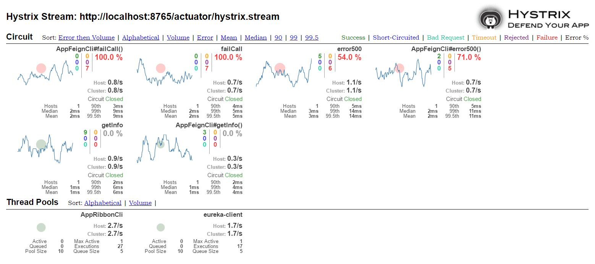

# spring-demo: feign, ribbon, hystrix
运行test步骤： 
1. 运行eureka-server 
2. 运行多个eureka-clint实例 
3. 执行本项目test 
4. 运行项目，HystrixDashboard：http://host:port/hystrix 
5. 监控数据：http://host:port/actuator/hystrix.stream 
6. rest.invoke-simulator=ture开启线程随机发请求产生dashboard数据 
 
## 说明
openfeign依赖ribbon做lb，需要ribbon的starter依赖； 
使用eureka时，服务发现需要引入eureka-client依赖；
